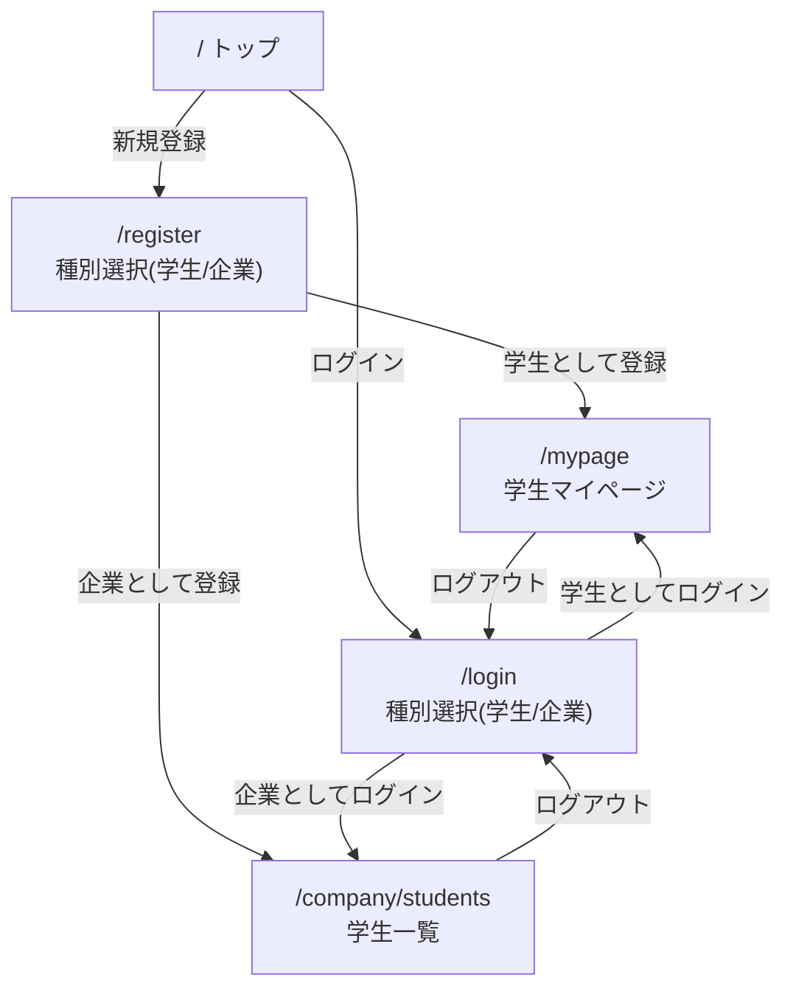
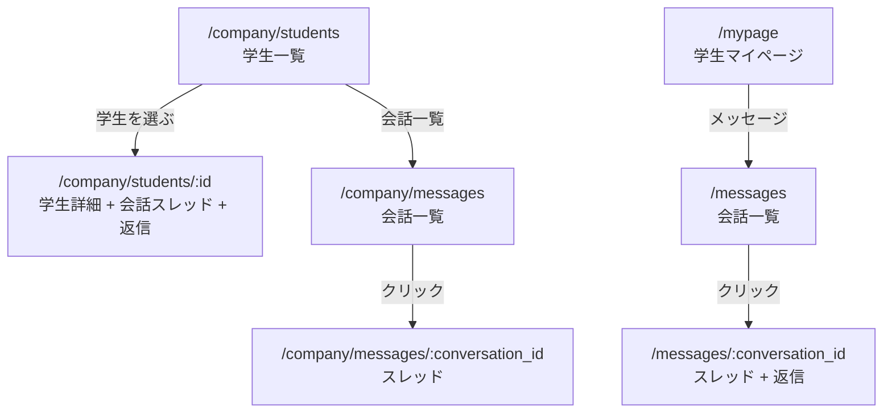
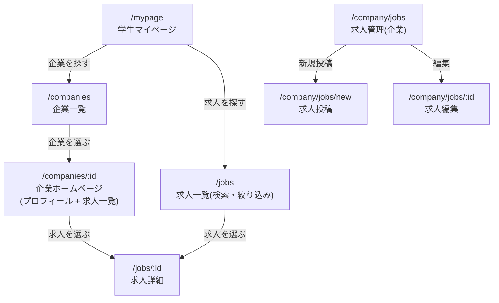

# 画面遷移・設計方針と実装差分

最終更新: 2026-09-15

この文書は、画面遷移と設計方針をまとめ、**「決定済みの方針」と「現在の実装」の差分（これからやること）** を一覧化したものである。

- 要件の正本: `docs/REQUIREMENTS.md`
- 開発の原則: `docs/PRINCIPLES.md`
- 進捗・設計経緯: `docs/PROGRESS.md`
- 作業再開用の要約: `docs/AI_HANDOFF.md`

## 用語

- **学生**: このサービス上で企業を探している/スカウトされたいユーザー。2026-09-11 に旧称「インターン生」から改称。
- **企業**: 学生を探し、メッセージを送る側のアカウント。
- **マイページ**: ログインした学生本人が、自分の登録情報を確認する画面(`/mypage`)。
- **学生一覧**: ログインした企業が、学生一覧を確認する画面(`/company/students`)。旧称「ダッシュボード」(`/companies/dashboard`)から改称済みで、旧URLは一時的にリダイレクトする。企業ログインが必須で、学生からはアクセスできない。
- **企業ホームページ**: 学生が閲覧する、企業の公開プロフィール＋求人一覧の画面(`/companies/:id`)。
- **求人**: 企業が掲載する募集。独立したモデル（`JobPosting` / `job_postings`）で、企業ホームページ上に一覧・詳細を表示する。
- **APIトークン**: ログイン成功時にサーバーが発行するランダム文字列。ブラウザの`localStorage`に保存し、以降のAPIリクエストで身元を証明する。

## 方針（決定事項）

1. ユーザー種別の呼称は **学生**（モデル名 `Student`）に統一する（旧: インターン生 / `Intern`）。
2. ログインは `/login` の1画面に統合し、**アカウント種別（学生/企業）を選択**する。
3. 新規登録は `/register` の1画面に統合し、**種別選択で入力項目を切替**える。
4. メッセージは双方向の「会話」として実装する（`Conversation` / `Message`）。
5. 学生も**企業一覧・企業ホームページ・求人**を閲覧できる。求人は独立モデル（`JobPosting` / `job_postings`）として企業が複数掲載する。
6. 学生登録の大学名入力に**サジェスト（入力補完）**を提供する。
7. **パスの名前空間**: 学生向けの企業閲覧は `/companies/*`（複数形）、企業の自社ツールは `/company/*`（単数形）に分離する（学生一覧は `/company/students`、旧 `/companies/dashboard`）。

## 実装優先順位

「必須／任意」の二分ではなく、上から順に完成させる。各段階で動作確認できる状態を保ち、期限が来た時点で完成している範囲を提出対象とする。

1. 学生の登録・ログイン・マイページ（完了）
2. メッセージ実装前の最小限の基盤整理（完了）
   - `Intern` / `interns` を `Student` / `students` へ変更する
   - 企業側学生一覧を最終パス `/company/students` へ移す
   - この2点は、会話の外部キー、関連名、画面リンク、APIテストを後から作り直さないために先に行う
3. 企業と学生のメッセージ（完了）
4. 統合ログイン / 登録（完了）
   - メッセージのモデル・関連付けには影響せず、後から変更しても主に認証画面と遷移先の修正で済むため後回しにする
5. 企業の求人掲載（実装済み・目視確認待ち）
6. 検索、大学サジェスト、お気に入りなどの追加機能

## 画面遷移

### 現状（実装済み）

### メッセージ機能（実装済み）

### 企業閲覧・求人（実装済み・目視確認待ち）

## パス対応表

### 画面パス

| 種別 | 現状 | 変更後（予定） | 備考 |
|---|---|---|---|
| 学生登録 | `/register` | `/register` | |
| 企業登録 | `/register` | `/register` | 旧 `/companies/new` は一時リダイレクト |
| 学生ログイン | `/login` | `/login` | 種別選択で学生を指定 |
| 企業ログイン | `/login` | `/login` | 旧 `/companies/login` は一時リダイレクト |
| 学生マイページ | `/mypage` | `/mypage` | 変更なし |
| 企業: 学生一覧 | `/company/students` | `/company/students` | 旧 `/companies/dashboard` は一時リダイレクト |
| 学生: 企業一覧 | （なし） | `/companies` | 新規 |
| 学生: 企業ホームページ | （なし） | `/companies/:id` | 新規 |
| 学生: 求人一覧(検索) | （なし） | `/jobs` | 新規 |
| 学生: 求人詳細 | （なし） | `/jobs/:id` | 新規 |
| 学生: お気に入り一覧 | （なし） | `/favorites` | 新規 |
| 企業: お気に入り学生一覧 | （なし） | `/company/favorites` | 新規 |
| 企業: 求人管理 | （なし） | `/company/jobs` | 新規 |

### APIパス / コード識別子

| 種別 | 現状 | 変更後（予定） |
|---|---|---|
| モデル | `Student` | `Student` |
| テーブル | `students` | `students` |
| 学生一覧API | `GET /students` | `GET /students` |
| 学生詳細API | `GET /students/:id` | `GET /students/:id` |
| 学生登録API | `POST /students` | `POST /students` |
| ログインAPI | `POST /login`（`account_type` で種別指定、旧 `/company_login` も一時維持） | `POST /login` |
| 認証種別 | `student` | `student` |
| トークンキー | `studentApiToken`（旧キー読込互換あり） | `studentApiToken` |
| フロント型 | `Student` | `Student` |
| 求人モデル | （なし） | `JobPosting` |
| 求人テーブル | （なし） | `job_postings` |

### メッセージ機能（実装済み）

| 画面 | パス |
|---|---|
| 企業: 学生詳細＋会話 | `/company/students/:id` |
| 企業: 会話一覧 | `/company/messages` |
| 企業: 会話スレッド | `/company/messages/:conversation_id` |
| 学生: 会話一覧 | `/messages` |
| 学生: 会話スレッド | `/messages/:conversation_id` |

#### API

| 操作者 | メソッド・パス | 用途 |
|---|---|---|
| 企業 | `GET /company/students/:student_id/conversation` | 学生プロフィールと自社との会話を取得する |
| 企業 | `POST /company/students/:student_id/messages` | 会話を取得または作成し、最初のメッセージを送る |
| 企業 | `GET /company/messages` | 自社の会話一覧を取得する |
| 企業 | `GET /company/messages/:conversation_id` | 自社が当事者である会話を取得する |
| 企業 | `POST /company/messages/:conversation_id/messages` | 自社が当事者である会話へ返信する |
| 学生 | `GET /messages` | 自分の会話一覧を取得する |
| 学生 | `GET /messages/:conversation_id` | 自分が当事者である会話を取得する |
| 学生 | `POST /messages/:conversation_id/messages` | 自分が当事者である会話へ返信する |

### メッセージのデータ設計・認可

#### `Conversation`

- `company_id`: `companies` への外部キー、`null: false`
- `student_id`: `students` への外部キー、`null: false`
- `(company_id, student_id)` に複合ユニークインデックスを設定し、1組につき1会話に限定する
- 初回送信時はトランザクション内で会話と最初のメッセージを作成する
- 同時送信で一意制約に競合した場合は、既存の会話を再取得してメッセージを追加する

#### `Message`

- `conversation_id`: `conversations` への外部キー、`null: false`
- `sender_type`: `company` / `student` のみ。DB制約とモデル検証の両方で保証する
- `body`: `text`、`null: false`。前後の空白を除いた後で1〜2000文字
- 表示順は `created_at ASC, id ASC` とし、同時刻でも順序が安定するようにする
- 会話削除時は所属メッセージも削除する

#### 認証・認可ルール

- 企業だけが学生を指定して新しい会話を開始できる。`company_id` は認証情報から、`student_id` は送信対象から決定する
- 学生は新しい会話を開始できないが、自分が当事者である既存会話へ返信できる
- `sender_type`、`company_id`、会話の所有者はクライアントから受け取らず、認証情報と対象会話からサーバー側で決定する
- 会話一覧・詳細・送信のすべてで、認証済みアカウントがその会話の当事者か確認する
- 他社・他学生の会話IDを指定した場合は内容の存在を推測させないよう `404` を返す
- 未認証は `401`、空本文・文字数超過などの入力不備は `422` とする

#### 最低限の受け入れテスト

- 企業が学生へ初回送信すると、会話1件とメッセージ1件が作成される
- 同じ企業と学生への再送信では会話が増えず、同じスレッドへメッセージが追加される
- 学生が自分の会話を閲覧・返信できる
- 未認証、別企業、別学生は会話を閲覧・送信できない
- クライアントが偽の `sender_type` や `company_id` を送っても採用されない
- 空本文と2000文字超過が拒否される
- 同じ組み合わせへの同時初回送信でも会話が重複しない

## 安全な移行手順

名称・パス変更は次の順序で行い、新旧のどちらからもアクセスできる期間を設ける。各段階を別変更として検証してから次へ進む。

### 1. DB・バックエンドの呼称移行

1. 既存のマイグレーションファイルは書き換えず、新しいマイグレーションで `interns` を `students` へ `rename_table` する
2. 外部キー作成前にモデルを `Student`、コントローラーを `StudentsController` へ変更する
3. `/students` APIに統一し、リクエスト・レスポンス名も `student` を使う

### 2. フロントエンドの呼称・トークン移行

1. 型、変数、API呼び出しを `Student` / `/students` へ切り替える
2. `studentApiToken` を学生用の保存キーとして使う
3. 登録・ログイン・マイページ・学生一覧が新APIだけで動くことを確認する

### 3. 画面パスの移行

1. `/company/students` を追加し、アプリ内リンクとログイン後の遷移先を新パスへ切り替える
2. `/companies/dashboard` は直ちに削除せず、認証情報とクエリ文字列を失わないリダイレクトとして残す
3. メッセージ画面は最初から `/company/students/:id` と `/company/messages/*` に作成する

### 4. 互換処理の削除

1. `rg` などで旧識別子・旧URLの利用箇所が互換処理以外に残っていないことを確認する
2. バックエンドのリクエストテスト、フロントエンドのlint・build、主要画面の手動遷移を確認する
3. 旧APIルート、旧画面リダイレクト、旧トークンキーのフォールバックは、切替完了後の別変更で削除する

### 5. 統合ログイン / 登録（完了）

1. `account_type` 付きの新しい `/login` と `/register` を追加済み
2. 既存の `/company_login` は互換APIとして一時的に残している
3. `/companies/new`、`/companies/login` は新画面へのリダイレクトへ変更済み
4. 目視確認後、旧APIは他の互換処理とまとめて削除する

## 現在の実装とのズレ（差分 = これからやること）

チェック済みの項目は実装・自動検証済み。旧ルートなどの互換処理は、後続機能の切替が完了するまで意図的に残す。

### 呼称変更（コード識別子のリネーム）

- [x] `Intern` モデル → `Student`、テーブル `interns` → `students`（追加マイグレーションで安全に改称）
- [x] `/students` ルートと `StudentsController` に統一
- [x] `sessions_controller.rb` 内の `Intern` 参照 → `Student`
- [x] `frontend/src/lib/types.ts` の `Intern` 型 → `Student`
- [x] `frontend/src/lib/auth.ts` の学生用トークンキーを `studentApiToken` に統一
- [x] `frontend/src/app/mypage/page.tsx`・`company/students/page.tsx` の `Student` 型参照
- [x] `backend/db/seeds.rb` の `Intern` 参照 → `Student`

### パス改称

- [x] `/companies/dashboard` → `/company/students`（画面・ルートとも）
- [ ] 企業の自社ツールを `/company/*`（単数形）へ移動（学生向けの `/companies/*` と分離）
- [x] 旧 `/companies/dashboard` は移行期間中リダイレクトとして残す

### メッセージ機能（実装済み）

- [x] 上記制約を含む `Conversation` / `Message` モデル + マイグレーション
- [x] 当事者確認と送信者のサーバー側決定を含むAPI
- [x] モデル・リクエストテスト（DB重複制約、未認証、他者アクセス、送信者偽装、入力不備）
- [x] 企業側: 学生詳細＋会話、会話一覧・スレッド
- [x] 学生側: 会話一覧・スレッド（返信フォーム付き）

### 統合ログイン/登録（実装済み・互換期間中）

- [x] `/login` を種別選択（学生/企業）付きに改修
- [x] `/register` を新設（種別選択で入力項目を切替）
- [x] `/companies/new` を `/register` へのリダイレクトに変更
- [x] `/companies/login` を `/login` へのリダイレクトに変更
- [x] API `POST /login` に `account_type` を追加
- [ ] 移行期間後に `POST /company_login` を削除
- [x] トップ `/` を「ログイン」「新規登録」の2リンクに簡素化

### 企業閲覧・求人（実装済み・目視確認待ち）

- [x] `JobPosting`（求人）モデル + `job_postings` テーブルのマイグレーション（`Company` に紐づく）
- [x] 求人のフィールド:
  - 必須: `title`(string) / `description`(text)
  - 任意(null許容): `location`(string) / `compensation`(string) / `period`(string) / `required_skills`(string)
- [x] 学生向けAPI: 企業一覧・詳細（`GET /companies`・`GET /companies/:id`）、求人一覧・詳細（`GET /jobs`・`GET /jobs/:id`）
- [x] 企業向けAPI: 求人一覧・詳細・作成・更新・削除（`/company/jobs`）
- [x] 学生側: 企業一覧・企業ホームページ・求人一覧・求人詳細画面
- [x] 企業側: 求人管理画面（投稿・一覧・編集・削除）
- [x] リクエストテスト（アカウント種別、他社求人、入力不備、CRUD、学生閲覧）

### 大学サジェスト（未着手）

- [ ] 候補データは**静的リスト**で進める（まずはフロントエンド定数＋`<datalist>` などで主要大学を数十校）
- [ ] 学生登録フォームの大学欄にオートコンプリート実装
- [ ] （将来設計）大学数が増えたら `University` モデル + `db/seeds.rb`（DB化）へ移行。それでも足りなければ外部APIを検討

### 検索・絞り込み（未着手）

- [ ] 学生検索（企業向け）: `/company/students` に絞り込みフォーム（キーワード / 大学 / 卒業年度 / スキル）
- [ ] 学生検索 API: `GET /students?q=&university=&graduation_year=&skills=`（`ILIKE` 部分一致など）
- [ ] 求人検索（学生向け）: 求人一覧 `/jobs` に絞り込みフォーム（キーワード / 勤務地 / 報酬 / 期間 / 求めるスキル）
- [ ] 求人検索 API: `GET /jobs?q=&location=&compensation=&period=&required_skills=`

### お気に入り／ブックマーク（未着手）

- [ ] 3方向のお気に入り: 企業→学生 / 学生→企業 / 学生→求人
- [ ] join モデル: `company_student_favorites` / `student_company_favorites` / `student_job_favorites`（各 unique 制約）
- [ ] 各一覧・詳細画面にお気に入りトグルを追加
- [ ] お気に入り一覧画面: 学生 `/favorites`、企業 `/company/favorites`
- [ ] API: お気に入り登録・解除（`POST/DELETE`）、一覧取得（`GET`）

### ドキュメント

- [x] `PROGRESS.md` の「ダッシュボード」定義を「学生一覧」へ更新（対応済み）
